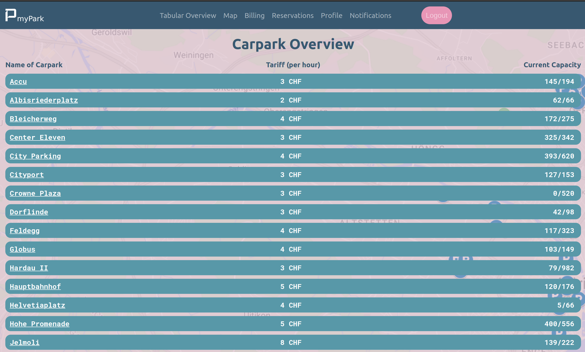
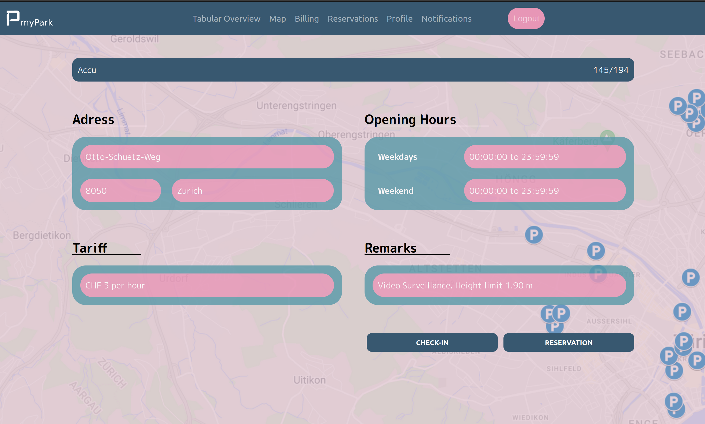
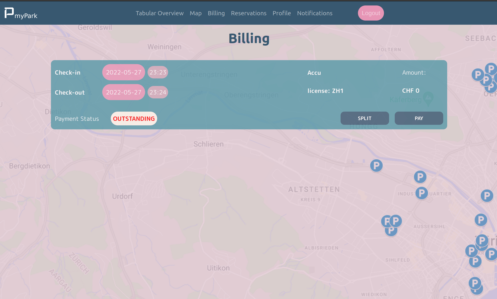
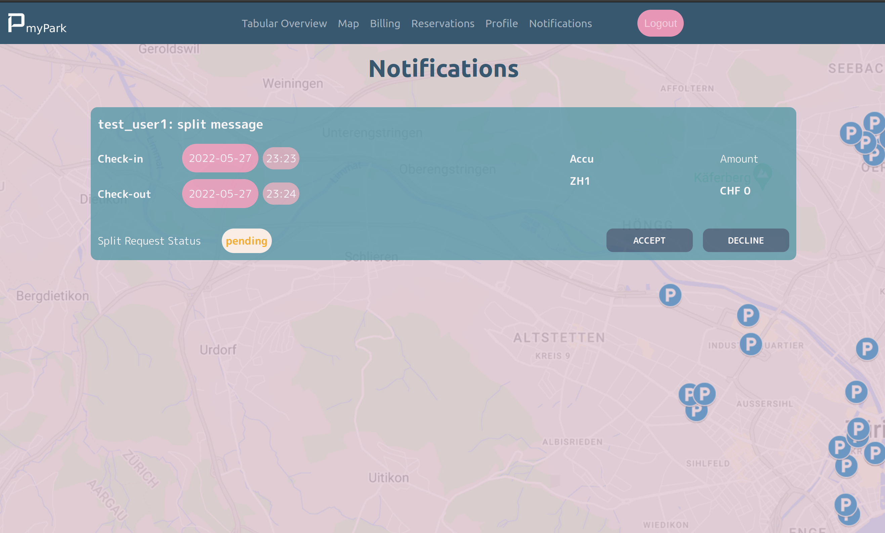

# SoPra Group 03 FS22 - myPark (Client)

## Introduction

Goal and motivation for project

## Technologies

List of technologies used

## High-Level Components

Project's 3-5 main components

## Getting Started

Read and go through these Tutorials. It will make your life easier!

- Read the React [Docs](https://reactjs.org/docs/getting-started.html)
- Do this React [Getting Started](https://reactjs.org/tutorial/tutorial.html) Tutorial (it doesn’t assume any existing React knowledge)
- Get an Understanding of [CSS](https://www.w3schools.com/Css/), [SCSS](https://sass-lang.com/documentation/syntax), and [HTML](https://www.w3schools.com/html/html_intro.asp)!

Next, there are two other technologies that you should look at:

* [react-router-dom](https://reacttraining.com/react-router/web/guides/quick-start) offers declarative routing for React. It is a collection of navigational components that fit nicely with the application. 
* [react-hooks](https://reactrouter.com/web/api/Hooks) let you access the router's state and perform navigation from inside your components.
### Launch & Deployment

For your local development environment, you will need Node.js. You can download it [here](https://nodejs.org). All other dependencies, including React, get installed with:

```npm install```

Run this command before you start your application for the first time. Next, you can start the app with:

```npm run dev```

Now you can open [http://localhost:3000](http://localhost:3000) to view it in the browser.

Notice that the page will reload if you make any edits. You will also see any lint errors in the console (use Google Chrome).

## Walkthrough & Illustrations

After the registration/login is completed successfully, users are redirected to the tabular overview which provides a complete list of available carparks in Zurich, their current capacity and the per-hour tariff.


<p align = "center">
<em>Carpark Overview</em>
</p>

In case this simple overview should not be sufficient for certain users, we additionally developed a carpark map, which is essentially a 2D-map version of the tabular overview page.


<p align = "center">
<em>Carpark Map</em>
</p>

From either the carpark map or the tabular overview users can access the carpark pages by clicking on the carpark name, or the carpark icon respectively. This carpark page provides further information about the carpark and allows the user to perform the real-time check-in and to reserve a parking spot in the future.


<p align = "center">
<em>Detailed Carpark Page</em>
</p>

After a user checks out from a carpark the respective fee will show up in their billing section with the option to pay or split the bill. Paying the bill is straightforward, however in case the user for example brought some friends over for a few drinks after a tough day working on a project, it is possible to send a split request to the remaining car users. Should the other user accept the split request, the bill is divided between the two users. Otherwise the initial bill will again show up as "outstanding" for the first user.


<p align = "center">
<em>Billing Page</em>
</p>

Once a user sends a split request to another user, a prompt will inform the second user that a notification is waiting in their notification section. Indeed, upon accepting the prompt (or simply clicking on the notification tab), the user can view their unanswered notifications and answer them on the spot.


<p align = "center">
<em>Notifications Page</em>
</p>

Further functionalities include:
- a profile page where users can view and edit their own profile
- the reservations page where upcoming reservations can be viewed and edited
- the "myPark" home button and the logout button

## Roadmap

- Establish a connection of this prototype to the city of Zurich / to the actual carparks
- Implement a real payment system (most probably also including Twint as a payment method)
- Develop a mobile application such that users can easily check-in into carparks via mobile app 

## Authors & Acknowledgements

-   [Noah Mamie](https://github.com/nmamie)
-   [Elias Schuhmacher](https://github.com/e-schuh)
-   [Kilian Sennrich](https://github.com/ksennr)
-   [Richard Specker](https://github.com/rspecker)

## License

[Apache License, 2.0](./LICENSE)